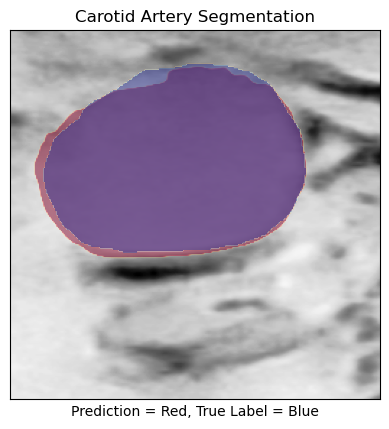
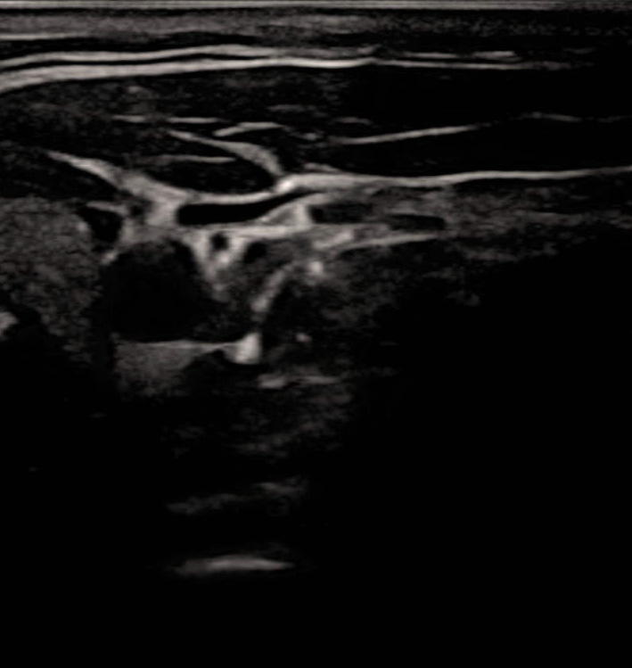
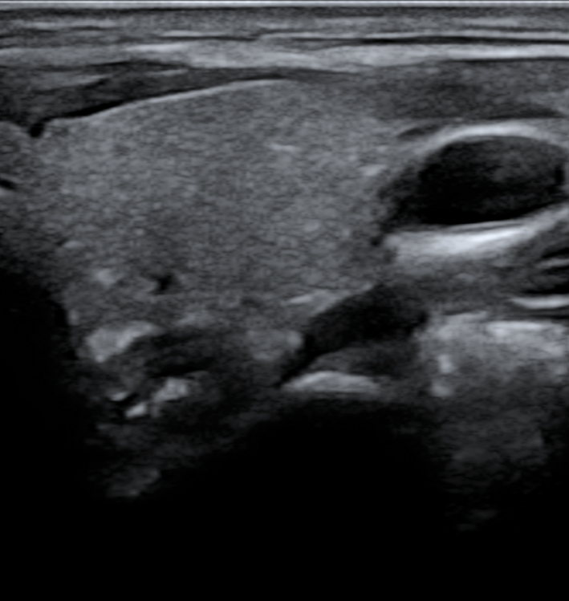
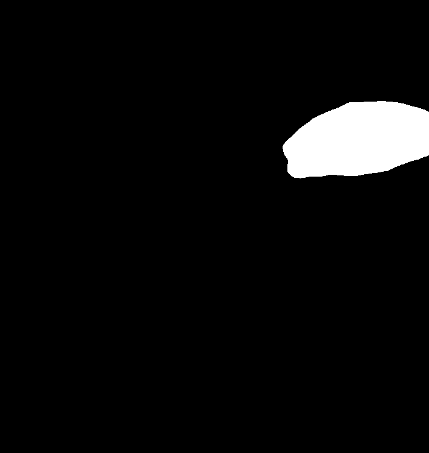
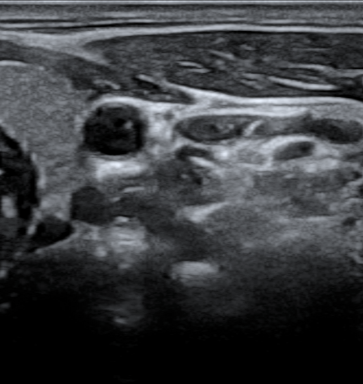
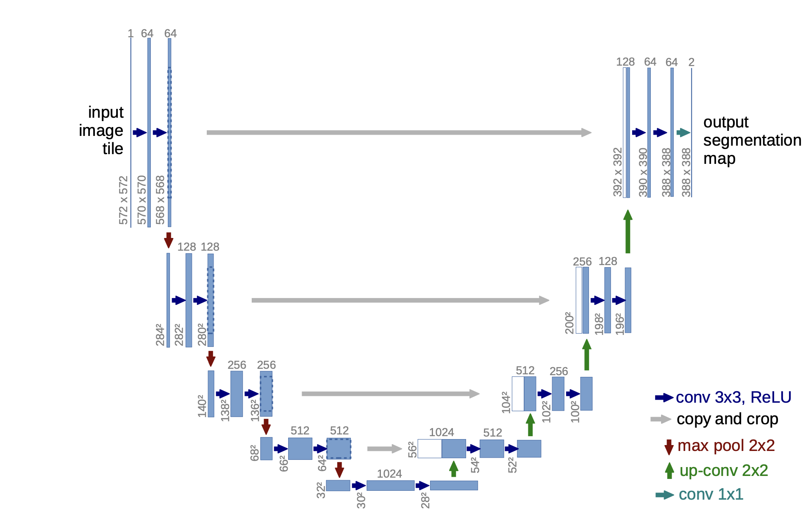

# Carotid Segmentation

UNET segmentation model for detecting carotid artery in ultrasound images



**Table of Contents**

- [Dataset](#dataset)
- [Model Architecture](#model-architecture)
- [Quickstart](#quickstart)


## Dataset
The **[Common Carotid Artery Ultrasound](https://data.mendeley.com/datasets/d4xt63mgjm/1)** dataset consists of aquistified ultrasound images of the common carotid artery. The images were taken from a Mindary UMT-500Plus ultrasound machine with an L13-3s linear probe. The study group consisted of 11 subjects, with each person examined at least once on the left and right sides. 2 subjects were examined using the vascular modality and 8 using the carotid modality. Time series (DICOM) were converted to png files and cropped appropriately. Each person had 100 images, making a total of 1100 images. The dataset also includes corresponding expert masks (corresponding file name) made by a technician and verified by an expert. The collection can be used for carotid artery segmentation and geometry measurement and evaluation. 

**Example Ultrasound Images and associated masks from dataset:**

  

## Model Architecture

[U-Net](https://arxiv.org/abs/1505.04597) is a is a semantic segmentation technique originally proposed for medical imaging segmentation. The architecture contains two paths. First path is the contraction path (encoder) which is used to capture the context in the image. The encoder is just a traditional stack of convolutional and max pooling layers. The second path is the symmetric expanding path (decoder) which is used to enable precise localization using transposed convolutions.


## Quickstart
With [conda](https://docs.conda.io/en/main/miniconda.html) installed, create and activate environment with the following bash commands:
```bash
>>> conda env create -f environment.yml
>>> conda activate py310
```

### Training
#### To run baseline model:
```bash
python train.py
```

#### To train a new model:
- Create a new `.yaml` config file [like this one](./config/unet_1.yaml) and add to `config/`

- Run the following command, specifying your model name as stored in above `.yaml` 
```bash
python train.py --model your_model_name
```